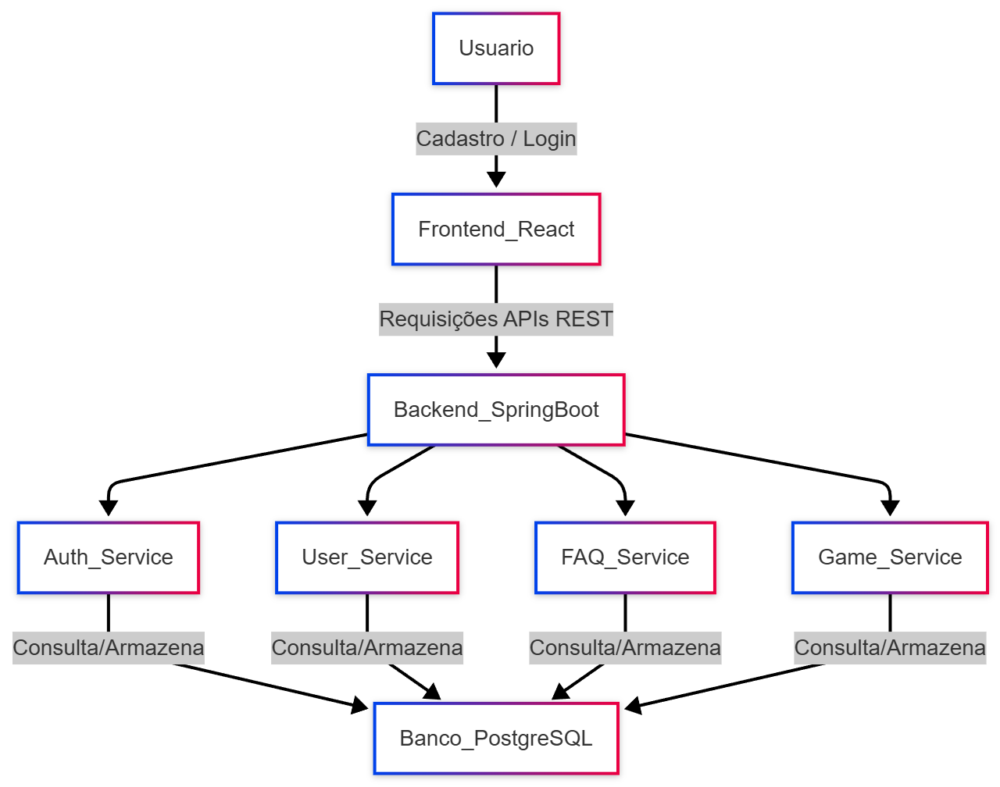

<div align="center">
 
  <h1>Documentação – Projeto Geral</h1>
</div>

O **Confia Aqui** é um projeto acadêmico desenvolvido como parte do curso de Ciência da Computação e Análise e Desenvolvimento de Sistemas, voltado para o desafio **Golpe do Presente**, com participação da **Dual Bradesco**. 

O objetivo do projeto é **ajudar a prevenir golpes relacionados ao "Golpe do Presente"**, oferecendo uma plataforma segura para os usuários, com funcionalidades que promovem confiança e transparência.

O projeto é dividido em **frontend e backend**, integrados via APIs REST, e cada domínio do sistema é organizado para facilitar escalabilidade e manutenção.


## 🚀 Tecnologias Utilizadas

**Frontend**:  
- React 
- TailwindCSS  
- Axios  
- React Router  

**Backend**:  
- Java 21  
- Spring Boot  
- Arquitetura MVC (Model-View-Controller)  
- API RESTful  
- Maven / Maven Wrapper  
- PostgreSQL (Azure)  
- Docker (MailHog)  

**Integração**:  
- APIs REST  
- JSON  
- JWT 

## 🧩 Arquitetura e Estrutura do Projeto

```text
confia-aqui/
├── backend/ → Aplicação Java 
├── docs/ → Imagens e recursos para o README.md
├── frontend/confia-aqui-frontend → Aplicação React
├── .gitattributes → Configurações Git
├── .gitignore → Arquivos e pastas ignorados pelo Git
└── README.md → Documentação geral do projeto
```
Responsabilidades principais: 
- **Backend**: Microsserviços em **Java com Spring Boot**, responsáveis por:
  - Autenticação e autorização de usuários
  - Gestão completa de usuários
  - CRUD de FAQs (admin)
  - Gamificação (pontos, níveis, badges)

- **Frontend**: Aplicação em **React.js**, responsável por:
  - Interface do usuário
  - Consumo das APIs REST do backend
  - Integração com serviços externos (ex.: Gemini)

- **Arquivos de configuração**: `.gitignore`, `.gitattributes` e `README.md` cuidam de regras de versionamento, padrões e documentação do projeto.


## ⚙️Funcionalidades

- **Usuários**:
  - Cadastro, login e gerenciamento completo de conta;
  - Sistema de gamificação para engajamento;
  - Integração com APIs externas (Gemini);
  - Recursos voltados à **segurança e prevenção de golpes**.
- **Admin**:
  - Login (o administrador já vem cadastrado diretamente no código);
  - CRUD para FAQs.

> ⚠️ **Atenção**: Usuário e Administrador fazem login na mesma página. A diferenciação é feita pelo **role token** retornado na autenticação.

## 🧩 Fluxo Geral do Sistema
<div align="center">
  
</div>

**Descrição do fluxo:**

1. O usuário acessa o frontend e faz cadastro e login.

2. O frontend envia requisições para o backend via APIs REST.

3. O backend processa as requisições nos microserviços:
  - Auth Service → autenticação e JWT
  - User Service → CRUD de usuários
  - FAQ Service → CRUD de FAQs (admin)
  - Game Service → gamificação
4. Os microserviços se comunicam com o banco PostgreSQL hospedado na Azure.

5. O backend retorna as respostas ao frontend, que exibe ao usuário.

## 🔗 Integração Frontend e Backend

O **frontend** se comunica com o **backend** através de **APIs REST**, garantindo que todas as funcionalidades da plataforma funcionem corretamente.

**Rotas Principais:**

| Rota         | Função                   |
|--------------|--------------------------|
| `/api/auth`  | Autenticação de usuários |
| `/api/user`  | CRUD de usuários         |
| `/api/faq`   | CRUD FAQs (admin)        |
| `/api/game`  | Gamificação              |


### Segurança e CORS
- O backend utiliza **Spring Security** para autenticação e autorização de usuários. 
- Todas as requisições do frontend devem incluir o token JWT gerado no login.
- **CORS** está configurado para permitir chamadas do frontend, garantindo que o navegador não bloqueie as requisições entre diferentes portas/dominios.

> ⚠️**Atenção**: Certifique-se de que a configuração de CORS no backend permita a origem `http://localhost:5173`.

### Requisitos para integração
 - Configure as variáveis URL base das APIs no frontend (.env);
 - Configure as variáveis do banco de dados no backend (.env);
 - Backend deve estar em execução antes do frontend.

## 🛠️ Como Executar 
#### 1. Clone o repositório
```bash
git clone https://github.com/AndradeRayssa/confia-aqui.git
```
#### 2. Siga as instruções
Para executar o projeto, siga as instruções detalhadas nos READMEs de cada parte do sistema:
- **Backend**: [Leia o README do backend](./backend/README.md)  
- **Frontend**: [Leia o README do frontend](./frontend/confia-aqui-frontend/README.md)  

> ⚠️**Atenção**: Não siga as instruções do Postman. Após iniciar o backend e o frontend, o sistema estará pronto para testes com o frontend.

## 📝 Contribuições
| Nome             | Função                                               |
|------------------|------------------------------------------------------|
| Beatriz Nagae    | Backend e Frontend                                   |
| Davi Rocha       | Banco de dados e Frontend                            |
| Fábio Gomes      | Banco de dados e Frontend                            |
| Karine Ferreira  | Frontend, Integração e Documentação frontend         |
| Rafael Carvalho  | Frontend                                             |
| Rayssa Andrade   | Backend, Integração e Documentação do Backend e Geral|
| Rhaissa Santos   | Frontend                                             |
